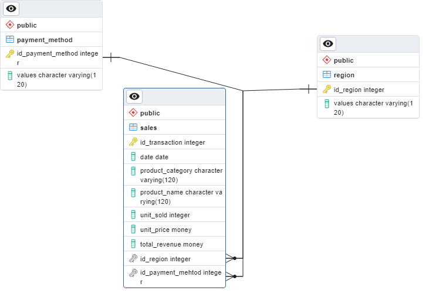
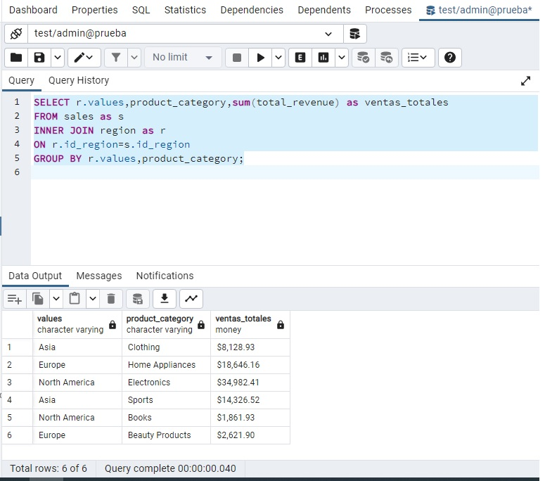
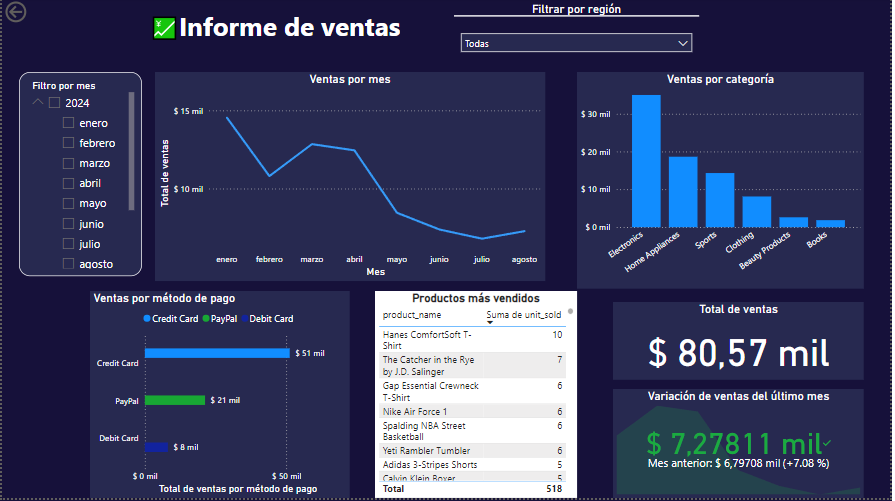

## Prueba Tecnica
### Franco Jonas Myburg

El primer paso fue realizar un análisis exploratorio de los datos, donde se observó que no había valores repetidos de filas, ya que cada fila contaba con un id de transacción único y no había valores nulos.además se 
Corroboró que no hubiera valores atípicos de los precios unitarios(considere que por mas de que existiera mas de un valor para un producto, los precios no variaban mucho).
El segundo paso fue realizar una normalización de la tabla en las columnas de región y método de pagos y por último se realizó la conexión con sqlAlchemy y se cargaron los dataframes a la base de datos de postgreSQL con las  tablas previamente creadas.
  

 
Librerías utilizadas:
* pandas
* sqlAlchemy
* psycopg2
* dotenv ("cargar las variables de entorno")
   
## parte 2

## tarea 2
 
La consulta de SQL se podría mejorar al modificar la tabla para que no acepte valores nulos en total_price y se evite filtrar la tabla
  

## Dashboard

 
El dashboard tiene dos filtros para los componentes, uno por mes y otro por región. 